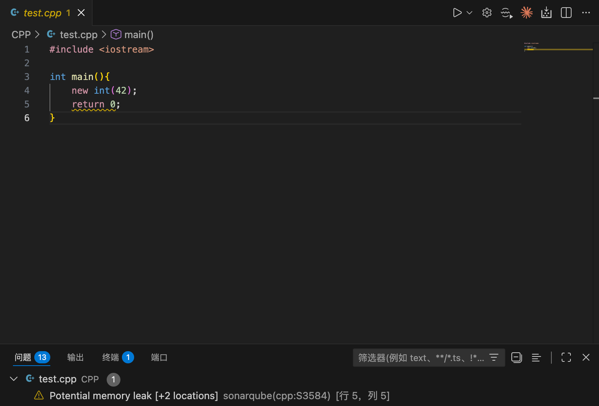
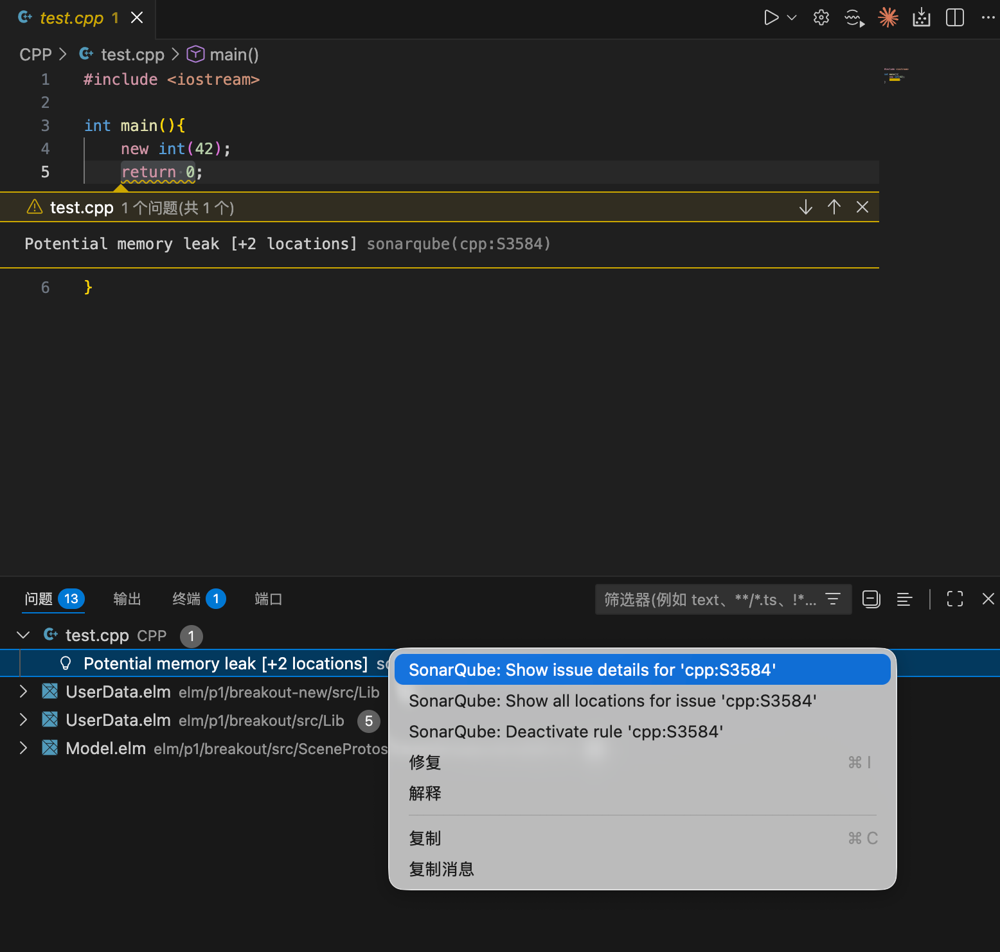
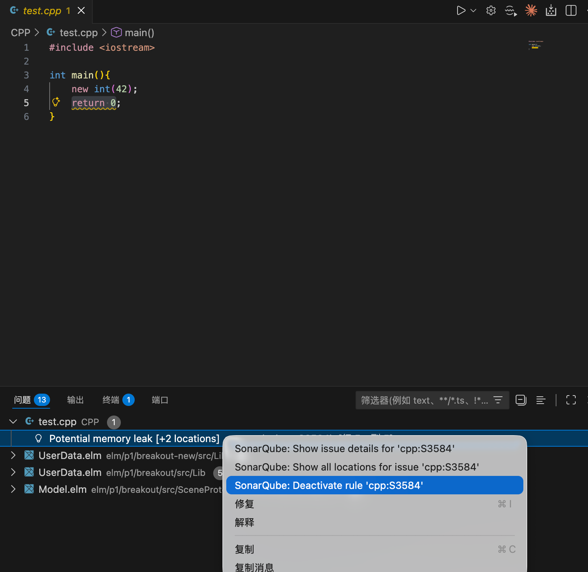

# SonarQube

SonarQube (原插件名 Sonarlint) 是一款强大的静态代码分析工具，可以直接集成到 VS Code 中，帮助开发者在编写代码时实时检测潜在的错误及安全漏洞。它通过提供即时反馈，协助开发者提高代码质量和可维护性。

## 主要功能：
1. **实时检测问题**：在代码编辑过程中，SonarQube 会自动扫描代码并标出潜在问题。
2. **支持多种编程语言**：包括 Java、Python、JavaScript、TypeScript、HTML 等，满足多语言项目需求。
3. **详细问题描述与修复建议**：对于检测到的问题，SonarQube 提供详细的描述和实际的修复建议，帮助开发者快速改进代码。
4. **与 SonarQube/SonarCloud 集成**：如果你的团队使用 SonarQube 或 SonarCloud，SonarQube插件 可以同步项目规则和配置，保持一致的代码质量标准。
5. **本地化分析**：无需依赖网络连接即可执行大部分分析，保证敏感代码的安全性。

## 安装


- 在VSCode插件市场中搜索SonarQube
- SonarQube依赖Java runtime environment，因此安装过程中需要下载jre，需要一些时间，请耐心等待安装完成

## C/C++

1. SonarQube对C/C++代码的分析依赖compile_commands.json文件。该文件包含了各c/c++文件的编译指令。可以使用CMake生成该文件。

- CMakeLists.txt:

```cmake
if(APPLE)
    execute_process(
        COMMAND xcrun --show-sdk-path
        OUTPUT_VARIABLE CMAKE_OSX_SYSROOT
        OUTPUT_STRIP_TRAILING_WHITESPACE
    )
endif()

cmake_minimum_required(VERSION 3.5)
project(p1)

# Generate compile_commands.json
set(CMAKE_EXPORT_COMPILE_COMMANDS ON)

set(SOURCE_FILES main.cpp)

add_executable(p1 ${SOURCE_FILES})

# Set the C++ Standard
set(CMAKE_CXX_STANDARD 17)

# Set the compiling flags
set(CMAKE_CXX_FLAGS "-Werror -Wpedantic -Wall -Wextra -Wvla -Wno-unused-result -Wconversion")
```
- 其中`if (APPLE)`部分是为了在MacOS上正确设置SDK路径，防止MacOS更新导致Darwin-Initialize.cmake报错。可以根据需要选择性添加

- 其中`set(CMAKE_EXPORT_COMPILE_COMMANDS ON)`会导出compile_commands.json文件

- 由于CMake会生成各种缓存和中间文件，建议将CMakeLists.txt放在项目根目录下，在根目录下建立build文件夹，在该文件夹中使用`cmake ..`、`make`等

```
project-root
├── build
│   ├── compile_commands.json
│   ├── CMakeCache.txt
│   ├── CMakeFiles
│   ├── Makefile
│   └── .cmake
├── CMakeLists.txt
├── main.cpp
└── Other source files...
```

1. 打开VSCode安装SonarQube并在工作区启用插件。右下角会有弹窗提示选择compile_commands.json。SonarQube会识别在项目根目录或者build文件夹中的compile_commands.json文件
2. SonarQube默认只会扫描最近打开的文件
3. 扫描到的问题会标记为warning（黄色波浪下划线）


4. 单击`Quick Fix... (Ctrl+.)`，选择`SonarQube: Open description of rule 'c:S107'`


5. 进入后查看该规则的介绍


6. 并非所有提示都是必要的。如果有暂未学到的或者你认为不需要的规则，可以将鼠标放到warning下划线处，单击`Quick Fix... (Ctrl+.)`，选择`SonarQube: Deactivate rule 'c:S1103'`或在插件窗口中找到对应规则并禁用


7. 对于部分简单的问题，SonarQube直接提供了修复方案，单击`Quick Fix... (Ctrl+.)`选择对应方案后可以直接修复
8. 单击`Quick Fix... (Ctrl+.)`，可以选择`Fix using Copilot`和`Explain using Copilot`（使用Copilot修复问题或者解释问题）