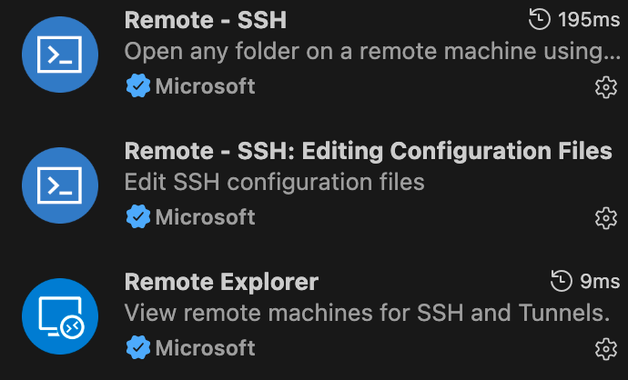

# VSCode 通过 SSH 连接虚拟机指南

## 前置准备

### 1. 安装 Remote-SSH 扩展
在 VSCode 中安装 `Remote - SSH` 扩展（扩展ID：`ms-vscode-remote.remote-ssh`）


### 2. 确保虚拟机 SSH 服务已启动

**WSL:**
```bash
sudo apt install openssh-server
sudo service ssh start
```

**OrbStack:**
OrbStack 默认已配置 SSH，无需额外设置。

## 连接方式

### 方式一：通过命令面板连接

1. 按 `Cmd+Shift+P`（macOS）或 `Ctrl+Shift+P`（Windows/Linux）
2. 输入 `Remote-SSH: Connect to Host...`
3. 输入连接地址，例如：
   - WSL: `用户名@localhost`
   - OrbStack: `用户名@容器名.orb.local`

### 方式二：配置 SSH Config 文件

1. 按 `Cmd+Shift+P`，选择 `Remote-SSH: Open SSH Configuration File...`
2. 选择 `~/.ssh/config`
3. 添加配置：

**WSL 配置示例：**
```
Host wsl
    HostName localhost
    User 你的用户名
    Port 22
```

**OrbStack 配置示例：**
```
Host orbstack
    HostName ubuntu.orb.local
    User root
```

4. 保存后，在 Remote Explorer 侧边栏中可直接点击连接

## 免密登录配置（推荐）

1. 在本地生成 SSH 密钥（如果没有）：
```bash
ssh-keygen -t ed25519
```

2. 将公钥复制到虚拟机：
```bash
ssh-copy-id 用户名@主机地址
```

## 常见问题

### 连接超时
- 检查虚拟机 SSH 服务是否运行：`sudo service ssh status`
- 检查防火墙设置

### 权限被拒绝
- 确认用户名和密码正确
- 检查 `/etc/ssh/sshd_config` 中 `PasswordAuthentication` 是否为 `yes`

### OrbStack 找不到主机
- 使用 `orb list` 查看可用容器
- 确认容器正在运行
